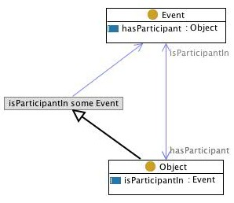
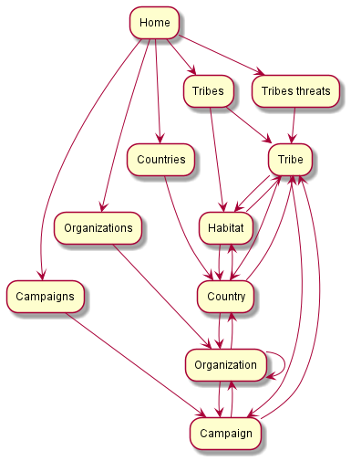
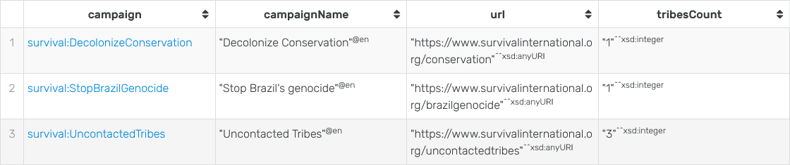
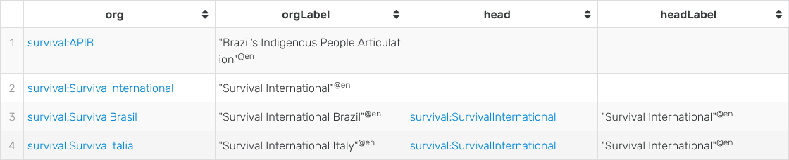

= Progetto di Modellazione Concettuale per il Web Semantico: Survival International Ontology
:author: Alessandro Contenti
:revnumber: 2021/2022
:version-label: A.A.
:toc: left
:toclevels: 2
:sectnums: true
:pagenums: true
:title-page:
:title-logo-image: image:images/unito.png[pdfwidth=33%]
:pdf-theme: theme.yml

== Introduzione

Il progetto svolto riguarda l'ambito della ONG "Survival International" e tutto il materiale prodotto è disponibile presso la https://github.com/acontenti/progetto-modsem[repository GitHub] del progetto stesso. +
L'ontologia in formato Turtle è accesibile al seguente link https://acontenti.github.io/progetto-modsem/survival.ttl (che è anche il suo IRI).

== Motivazioni

Il dominio che ho deciso di modellare riguarda il contesto e le operazioni dell'associazione senza scopo di lucro "Survival International".

Survival International è un movimento internazionale per la salvaguardia deii diritti dei popoli indigeni.
È stata fondata nel 1969 a Londra, a seguito della pubblicazione di un articolo del Sunday Times, che narrava il genocidio dei popoli amazzonici.
La sua missione è aiutare i popoli indigeni e tribali a difendere le loro vite, le loro terre e i loro fondamentali diritti umani contro ogni forma di persecuzione, razzismo e genocidio.

A partire dalla sua fondazione, Survival ha portato avanti decine di campagne a favore dei popoli indigeni, ricevendo il sostegno di centinaia di migliaia di persone.

L'idea di modellare il dominio di Survival International mi è venuta leggendo casualmente un articolo riguardo questa associazione, in relazione alle loro campagne a supporto dei popoli incontattati, tema che mi incuriosisce molto.

== Requisiti

=== Finalità

La finalità dello sviluppo di un'ontologia che descriva il contesto sia culturale che geografico in cui opera Survival, le operazioni che svolge e le criticità che deve affrontare è quello di creare una solida base di conoscenza che contenga tutte le informazioni utili per facilitare le operazioni interne dell'associazione e la comunicazione con il pubblico.

Nell'ontologia da me creata vi è solamente un sottoinsieme di tutte le informazioni che potrebbero essere incluse in una base di conoscenza del genere. +
Sia perché alcuni concetti potrebbero essere dettagliati con una granularità più fine. +
Sia perché manca la modellazione di alcuni ambiti, come ad esempio la gestione dei contatti locali con i popoli indigeni e dei contatti governativi, la gestione dei fondi e molti altri aspetti su cui, da esterni, è impossibile ottenere informazioni.

=== Task

Alcuni task specifici dell'ontologia modellata sono:

* Gestire una lista aggiornata dei popoli indigeni che necessitano di aiuto da parte di Survival o che comunque sono oggetto d'interesse
* Gestire una lista aggiornata delle campagne in corso o passate e da chi sono gestite (per esempio se sono condivise con altre associazioni)
* Gestire una lista delle sedi locali di Survival e delle associazioni con cui collabora
* Cercare velocemente quali sono le minacce che mettono in pericolo uno specifico popolo indigeno e quali campagne sono in atto a loro supporto
* Localizzare facilmente i vari popoli per area geografica, visualizzando anche quali popoli condividono la stessa

=== Utenti

Gli utenti che potrebbero trarre giovamento dall'utilizzo di questa ontologia sono:

* *Personale di Survival*: per gestire e aggiornare la base di conoscenza e usarla per programmare e tenere sotto controllo le campagne e le operazioni da svolgere
* *Sostenitori di Survival*: per seguire le varie campagne in atto e la situazione dei vari popoli indigeni
* *Pubblico*: per scoprire le iniziative di Survival o informarsi riguardo i vari popoli indigeni

== Descrizione del dominio

=== Dominio

Il dominio è composto da un insieme di concetti top-level, cui corrisponde una specifica classe nell'ontologia:

Tribù::
Una tribù o un popolo indigeno oggetto dell'attenzione e delle campagne di Survival e/o di altre organizzazioni
Minaccia::
Con minaccia si intende o un generico problema che affligge più popoli indigeni, accomunandoli come protagonisti di una campagna, oppure un problema che affligge una specifica tribù.
Campagna::
Una campagna può essere diretta ad affrontare in generale una minaccia che riguarda molte comunità indigene, oppure si rivolge direttamente ad una specifica tribù, affrontandone le varie problematiche
Organizzazione::
Un'organizzazione è un generico ente che collabora con Survival (come anche Survival stessa e le sue sedi locali).
Un'organizzazione può essere legata a una campagna che conduce (o co-conduce).
Luogo::
Un luogo indica in generale un'area geografica, più specificamente un continente, un paese o un habitat.
Quest'ultimo rappresenta un'area in cui vivono una (o più) tribù e popoli indigeni, atta a circoscrivere più precisamente i territori in cui vivono queste popolazioni, che spesso si estendono oltre i confini di un singolo paese.

=== Riferimenti

La stragrande maggioranza delle informazioni riguardanti i temi chiave di questa ontologia, ovvero popoli indigeni, minacce, campagne di Survival, organizzazioni sono tratte dai siti web di Survival in inglese e italiano:

* Survival International: https://www.survivalinternational.org
* Survival International Italia: https://www.survival.it

Purtroppo le informazioni sono un po' frammentate e organizzate in modo poco sistematico.
Probabilmente per fare più colpo sui lettori, piuttosto che per dare una documentazione precisa. +
Alcune pagine non sembrano molto aggiornate, per cui è stato necessario integrare qualche volta con enciclopedie online come:

* Wikipedia: https://en.wikipedia.org/ e https://it.wikipedia.org/
* Enciclopedia Treccani: https://www.treccani.it/enciclopedia/

Queste sono state utilizzate anche per trarre informazioni su concetti non specifici dell'ambito di Survival, come ad esempio continenti e paesi.

È stato inoltre consultato il sito dell'Articulation of Indigenous Peoples of Brazil (APIB): https://apiboficial.org/

== Documentazione sul dominio

Come già riportato alla sezione precedente la maggioranza delle informazioni utilizzate per documentarsi sul dominio modellato deriva dai siti istituzionali di Survival International in italiano e inglese, che riportano circa le stesse informazioni nelle due lingue (il sito italiano non è sempre aggiornato come quello inglese).
Quindi per semplicità mi riferiro ad entrambi indifferentemente come "il sito di Survival".

Il sito di Survival, appare poco strutturato e coerente: spesso alcune pagine evidentemente più vecchie hanno un'interfaccia diversa dalle altre. +
Tuttavia presenta un minimo di suddivisione delle informazioni: è possibile infatti vedere una lista dei popoli indigeni seguiti da Survival, suddivisi per tree macroaeree: le Americhe, Africa e Asia ed Australasia.

.Elenco di popoli indigeni

Inoltre è possibile vedere una lista (poco esaustiva) delle campagne in corso.

.Piccola lista di alcune campagne di Survival

Aprendo ad esempio la pagina della campagna "Stop Brazil's Genocide" (inclusa nell'ontologia) ci si trova di fronte ad un lungo articolo, molto interessante, ma totalmente privo di informazioni strutturate: senza leggerlo per intero è impossibile campire al volo quali popoli siano interessati da questa campagna, chi vi collabori, se sia ancora in corso o terminata. +
Leggendo bene fino a circa metà pagina, si nota che è una campagna in cui Survival collabora con l'APIB, l’_Associazione dei Popoli Indigeni del Brasile_ (anch'essa inclusa nell'ontologia).

.Pagina della campagna "Stop Brazil's Genocide"

Anche il sito web dell'assoziazione APIB sopracitata è stato utilizzato per documentarsi, ma è ancora meno strutturato e caotico (e presenta anche qualche bug). +
Le informazioni sono sparse su varie pagine poco chiaramente accessibili e talvolta disponibili solo in portoghese.

.Sito web dell'APIB

Data la scarsità di informazioni pratiche, in favore di "propaganda" e richieste di donazioni o firme per la causa (fatto comprensibilissimo, ma in questo caso spiacevole), è stato talvolta necessario documentarsi su Wikipedia.

.Pagina Wikipedia del popolo Yanomamö, interessato dalla camapagna precedente

In conclusione, date le note negative espresse sul sito di Survival e altre associazioni analoghe, l'idea di fondo di questa ontologia e dell'applicazione client derivante è quella di permettere agli utenti di avere informazioni chiare e facilmente accessibili, il più possibili ricche di dettagli, piuttosto che di appelli.

Sarebbe molto interessante poter unire i due aspetti in un possibile "nuovo" sito web di Survival che presenti tutti i contenuti già visibili, ma ben collegati semanticamente e con allegate schede che illustrino in breve le informazioni chiave. +
Così da non trascurare l'informatività del sito, pur mantenendo la sua funzione giustamente "propagandistica".

=== Allineamenti

L'ontologia sviluppata è stata allineata sia con https://schema.org/[Schema.org] che con https://www.wikidata.org/[Wikidata].

Con _Schema.org_ sono state allineate solo alcune classi e proprietà che rappresentano concetti o relazioni di alto livello, poiché non vi è molta sovrapposizione tra le due ontologie.

.Classi:
* `survival:Location` -> `schema:Place`
* `survival:Continent` -> `schema:Continent`
* `survival:Country` -> `schema:Country`
* `survival:Organization` -> `schema:Organization`

.Proprietà:
* `survival:locatedIn` -> `schema:location`
* `survival:branchOf` -> `schema:parentOrganization`
* `survival:hasBranch` -> `schema:subOrganization`

Con _Wikidata_, grazie alla sua grande varietà, invece sono state allineate non solo molte classi e proprietà, ma anche moltissimi individui. +
Dato il grande numero non è possibile riportare tutti gli allineamenti, per cui saranno riportati solo alcuni esempi significativi.

.Classi:
* `survival:Tribe` -> `wd:Q103817` (_indigenous people_)
* `survival:Campaign` -> `wd:Q18812548` (_campaign_)
* `survival:Organization` -> `wd:Q43229` (_organization_)

.Proprietà:
* `survival:locatedIn` -> `wdt:P706` (_located in/on physical feature_)
* `survival:branchOf` -> `wdt:P749` (_parent organization_)

.Individui:
* `survival:SurvivalInternational` -> `wd:Q1887464` (_Survival International_)
* `survival:APIB` -> `wd:Q16494254` (_Brazil's Indigenous People Articulation_)
* `survival:NorthSentinel` -> `wd:Q1260331` (_North Sentinel Island_)
* `survival:Sentinelese` -> `wd:Q917695` (_Sentinelese people_)

Tutti gli allineamenti delle classi sono stati effettuati con la proprietà `owl:equivalentClass` perché sono state scelte classi che rappresentassero esattamente lo stesso concetto nelle varie ontologie. +
Per quanto riguarda le proprietà si è utlizzato `owl:equivalentProperty` per tutte le proprietà strettamente equivalenti, tranne in qualche caso in cui si è utilizzato `rdfs:subPropertyOf` per proprietà che sussumessero la proprietà importata. +
Per gli tutti individui si è naturalmente utilizzato `owl:sameAs`.

== LODE

La documentazione generata con LODE (per la precisione con il tool https://github.com/dgarijo/Widoco[WIDOCO] che utilizza LODE) è disponibile al seguente indirizzo web: https://acontenti.github.io/progetto-modsem/index-en.html

== Visualizzazione

=== Tassonomia delle classi

=== Template

Durante lo sviluppo dell'ontologia si è deciso di utilizzare gli Ontology Design Patterns http://ontologydesignpatterns.org/wiki/Submissions:Participation["Participation"] e http://ontologydesignpatterns.org/wiki/Submissions:Co-participation["Co-participation"].

.Diagramma dell'ODP "Participation"

L'ODP Participation è stato utilizzato per differenziare gli oggetti dagli eventi e stabilire la partecipazione degli oggetti agli eventi. +
Nello specifico la classe `survival:Campaign` è stata resa sottoclasse di `Event` mentre tutte le altre classi sono state rese sottoclassi di `Object`. +
Inoltre, la proprietà `survival:leads`, che mette in relazione `survival:Organization` con `survival:Campaign`, è stata resa sottoproprietà di `isParticipantIn`; lo stesso per la proprietà inversa `survival:ledBy` con `hasParticipant`.

.Diagramma dell'ODP "Co-participation"
image::images/coparticipation.jpg[align=center]

Quindi, grazie all'ODP Co-participation (che estende l'ODP Participation), si è modellata la proprietà simmetrica `survival:collaboratesWith` tra due `survival:Organization`, come sottoproprietà di `coparticipatesWith`.
Ciò indica che due oggetti, in questo caso due organizzazioni, collaborano in un evento, in questo caso una campagna, se entrambe partecipano ad uno stesso evento.

=== Esempio

.Grafico di esempio di utilizzo della proprietà `survival:collaboratesWith`

.Triple che descrivono la proprietà `survival:collaboratesWith`

.Triple che descrivono un esempio di utilizzo della proprietà `survival:collaboratesWith`

== Queries SPARQL

Qui di seguito è presente il materiale riguardante la sezione delle queries SPARQL. +
Sono state create 5 query principali e 5 query accessorie.

=== Flow-chart

Il flow-chart seguente descrive lo schema di interazione dell'applicazione nel complesso. +
Sono rappresentate tutte le pagine e come nodi del grafo, mentre le frecce indicano la possibilità di navigare da una pagina all'altra. +
Per evitare di appesantire eccessivamente il grafico, si sono evitate le frecce che collegano tra loro le pagine "top-level", cioè quelle accessibili dalla barra di navigazione, proprio perché sono sempre accessibili da qualsiasi pagina.

.Flow-chart dell'interazione

=== Mockups

I seguenti mockup illustrano alcuni esempi di pagine del progetto dell'applicazione client. +
Oltre alla pagina iniziale, vi sono fondamentalmente due tipologie di pagine: quelle che presentano una lista di elementi, come la seconda e la terza, e quelle che rappresentano il dettaglio di un singolo elemento, come le ultime due.

.Pagina iniziale
image::images/mockup-home-Home.png[align=center]

.Pagina "Tribes"
image::images/mockup-home-Tribes.png[align=center]

.Pagina "Countries"
image::images/mockup-home-Countries.png[align=center]

.Pagina "Tribe" per l'individuo "survival:Sentinelese"

.Pagina "Organization" per l'individuo "survival:SurvivalInternational"

=== Queries principali

Queste sono le query principali dell'applicazione client e sono accessibili tramite il menù di navigazione

==== Tribes

Questa query restituisce la lista dei popoli indigeni presenti nell'ontologia e, per ogni popolo, restituisce anche il nome, se è contattato o meno e l'habitat in cui vive con il relativo nome.

[source,sparql]
----
PREFIX survival: <https://acontenti.github.io/progetto-modsem/survival.ttl#>
PREFIX rdf: <http://www.w3.org/1999/02/22-rdf-syntax-ns#>
PREFIX rdfs: <http://www.w3.org/2000/01/rdf-schema#>
PREFIX onto: <http://www.ontotext.com/>

SELECT ?tribe ?name ?contacted ?habitat (MAX(?hLabel) as ?habitatLabel)
FROM onto:disable-sameAs
WHERE {
    ?tribe rdf:type survival:Tribe;
           survival:name ?name;
           survival:contacted ?contacted;
           survival:livesIn ?habitat.
    ?habitat rdfs:label ?hLabel.
    FILTER(LANG(?hLabel) = "" || LANGMATCHES(LANG(?hLabel), "en"))
}
GROUP BY ?tribe ?name ?contacted ?habitat
ORDER BY ?name
----

.Esempio di risultato della query
image::images/query-tribes.png[align=center]

==== Countries

Questa query restituisce la lista dei paesi presenti nell'ontologia e per ciascuno restituisce anche il relativo nome, il nome del continente in cui sitrova e il numero di popoli indigeni che vi risiedono.

[source,sparql]
----
PREFIX survival: <https://acontenti.github.io/progetto-modsem/survival.ttl#>
PREFIX rdf: <http://www.w3.org/1999/02/22-rdf-syntax-ns#>
PREFIX rdfs: <http://www.w3.org/2000/01/rdf-schema#>
PREFIX onto: <http://www.ontotext.com/>

SELECT ?country ?countryLabel ?continentLabel ?tribesCount
FROM onto:disable-sameAs
WHERE {
    ?country rdf:type survival:Country;
             rdfs:label ?countryLabel;
             survival:locatedIn ?continent.
    ?continent rdfs:label ?continentLabel.
    OPTIONAL {
        SELECT ?country (COUNT(?tribe) as ?count)
        WHERE {
            ?tribe rdf:type survival:Tribe;
                   survival:livesIn ?habitat.
            ?habitat rdf:type survival:Habitat;
                     survival:locatedIn ?country.
        } GROUP BY ?country
    }
    FILTER(LANG(?countryLabel) = "" || LANGMATCHES(LANG(?countryLabel), "en"))
    FILTER(LANG(?continentLabel) = "" || LANGMATCHES(LANG(?continentLabel), "en"))
    BIND(COALESCE(?count, 0) AS ?tribesCount)
}
----

.Esempio di risultato della query
image::images/query-countries.png[align=center]

==== Campaigns

Questa query restituisce la lista delle campagne presenti nell'ontologia e, per ogni campagna, restituisce anche il relativo nome, l'URL della pagina web della campagna e il numero di popoli indigeni aiutati da essa.

[source,sparql]
----
PREFIX survival: <https://acontenti.github.io/progetto-modsem/survival.ttl#>
PREFIX rdf: <http://www.w3.org/1999/02/22-rdf-syntax-ns#>
PREFIX rdfs: <http://www.w3.org/2000/01/rdf-schema#>
PREFIX onto: <http://www.ontotext.com/>

SELECT ?campaign ?campaignName ?url (COUNT(?tribe) AS ?tribesCount)
FROM onto:disable-sameAs
WHERE {
    ?campaign rdf:type survival:Campaign;
              rdfs:label ?campaignName;
              survival:campaignPage ?url;
              survival:helps ?tribe.
    FILTER(LANG(?campaignName) = "" || LANGMATCHES(LANG(?campaignName), "en"))
}
GROUP BY ?campaign ?campaignName ?url
ORDER BY ?campaignName
----

.Esempio di risultato della query

==== Organizations

Questa query restituisce la lista delle organizzazioni presenti nell'ontologia e per ciascuna restituisce anche il nome e l'organizzazione cui fa capo (se ne ha una) con il relativo nome.

[source,sparql]
----
PREFIX survival: <https://acontenti.github.io/progetto-modsem/survival.ttl#>
PREFIX rdf: <http://www.w3.org/1999/02/22-rdf-syntax-ns#>
PREFIX rdfs: <http://www.w3.org/2000/01/rdf-schema#>
PREFIX owl: <http://www.w3.org/2002/07/owl#>
PREFIX onto: <http://www.ontotext.com/>

SELECT ?org (MAX(?label) as ?orgLabel) ?head (MAX(?hLabel) as ?headLabel)
FROM onto:disable-sameAs
WHERE {
    ?org rdf:type survival:Organization;
         rdfs:label ?label.
    OPTIONAL {
        ?org survival:branchOf ?head.
        ?head rdfs:label ?hLabel.
        FILTER(LANG(?hLabel) = "" || LANGMATCHES(LANG(?hLabel), "en"))
    }
    FILTER(LANG(?label) = "" || LANGMATCHES(LANG(?label), "en"))
}
GROUP BY ?org ?head
ORDER BY ?orgLabel
----

.Esempio di risultato della query

==== Tribes threats

Questa query restituisce la lista dei popoli indigeni presenti nell'ontologia e, per ogni popolo, restituisce anche il relativo nome, le minacce cui è sottoposto (sotto forma di concatenazione di stringhe). +
Inoltre per ogni popolo restituisce un "threat score", ovvero un punteggio da 0 a 1 che esprime quanto il popolo in questione sia in pericolo, calcolato sul numero di minacce subite.

[source,sparql]
----
PREFIX survival: <https://acontenti.github.io/progetto-modsem/survival.ttl#>
PREFIX rdf: <http://www.w3.org/1999/02/22-rdf-syntax-ns#>
PREFIX onto: <http://www.ontotext.com/>
PREFIX rdfs: <http://www.w3.org/2000/01/rdf-schema#>

SELECT ?tribe ?name ?threats (?count/?max AS ?threatScore)
FROM onto:disable-sameAs
WHERE {
    {
        SELECT (MAX(?count) AS ?max)
        WHERE {
            SELECT ?tribe (COUNT(?threat) as ?count)
            WHERE {
                ?tribe survival:threatenedBy ?threat.
            }
            GROUP BY ?tribe
        }
    }
    {
        SELECT ?tribe ?name (COUNT(?threat) as ?count) (GROUP_CONCAT(?threatLabel;separator=', ') AS ?threats)
        WHERE {
            ?tribe rdf:type survival:Tribe;
                   survival:name ?name;
                   survival:threatenedBy ?threat.
            ?threat rdfs:label ?threatLabel.
            FILTER(LANG(?threatLabel) = "" || LANGMATCHES(LANG(?threatLabel), "en"))
        }
        GROUP BY ?tribe ?name
    }
}
----

.Esempio di risultato della query
image::images/query-threats.png[align=center]

=== Queries aggiuntive dell'applicazione client

Le seguenti query sono utilizzate dall'applicazione client per estrarre dettagli e informazioni utili per un singolo individuo dell'ontologia.

==== Tribe

Questa query, dato l'IRI di un popolo indigeno (`survival:Tribe`), ne restituisce il nome, la descrizione, se è contattato, le minacce cui è sottoposto, gli habitat in cui vive e i paesi in cui vive (inferito dagli habitat)

[source,sparql]
----
PREFIX survival: <https://acontenti.github.io/progetto-modsem/survival.ttl#>
PREFIX rdf: <http://www.w3.org/1999/02/22-rdf-syntax-ns#>
PREFIX onto: <http://www.ontotext.com/>

PREFIX rdfs: <http://www.w3.org/2000/01/rdf-schema#>
SELECT ?name ?comment ?contacted ?threats ?habitat ?habitatLabel ?country ?countryLabel ?campaign ?campaignLabel
FROM onto:disable-sameAs
WHERE {
    {
        SELECT ?tribe ?name ?comment ?contacted (GROUP_CONCAT(DISTINCT ?threatLabel;separator=', ') AS ?threats) ?habitat (MAX(?hLabel) AS ?habitatLabel) ?country (MAX(?cLabel) AS ?countryLabel) WHERE {
            BIND(<${id}> AS ?tribe)
            ?tribe survival:name ?name;
                   rdfs:comment ?comment;
                   survival:contacted ?contacted;
                   survival:livesIn ?habitat.
            FILTER(LANG(?comment) = "" || LANGMATCHES(LANG(?comment), "en"))
            OPTIONAL {
                ?tribe survival:threatenedBy ?threat.
                ?threat rdfs:label ?threatLabel.
                FILTER(LANG(?threatLabel) = "" || LANGMATCHES(LANG(?threatLabel), "en"))
            }
            OPTIONAL {
                ?tribe survival:livesIn ?habitat.
                ?habitat rdfs:label ?hLabel.
                FILTER(LANG(?hLabel) = "" || LANGMATCHES(LANG(?hLabel), "en"))
            }
            OPTIONAL {
                ?habitat survival:locatedIn ?country.
                ?country rdf:type survival:Country;
                         rdfs:label ?cLabel.
                FILTER(LANG(?cLabel) = "" || LANGMATCHES(LANG(?cLabel), "en"))
            }
        } GROUP BY ?tribe ?name ?comment ?contacted ?habitat ?country
    }
    OPTIONAL {
        ?tribe survival:helpedBy ?campaign.
        ?campaign rdfs:label ?campaignLabel.
        FILTER(LANG(?campaignLabel) = "" || LANGMATCHES(LANG(?campaignLabel), "en"))
    }
}
----

==== Country

Questa query, dato l'IRI di un paese (`survival:Country`), ne restituisce il nome, il continente in cui è situato, gli habitat che contiene e le organizzazioni che vi hanno sede

[source,sparql]
----
PREFIX survival: <https://acontenti.github.io/progetto-modsem/survival.ttl#>
PREFIX rdf: <http://www.w3.org/1999/02/22-rdf-syntax-ns#>
PREFIX onto: <http://www.ontotext.com/>
PREFIX rdfs: <http://www.w3.org/2000/01/rdf-schema#>

SELECT (MAX(?label) AS ?name) (MAX(?cLabel) AS ?continentLabel) ?habitat (MAX(?hLabel) AS ?habitatLabel) ?tribe ?tribeLabel ?org (MAX(?oLabel) AS ?orgLabel)
FROM onto:disable-sameAs
WHERE {
    BIND(<${id}> AS ?country)
    ?country rdfs:label ?label.
    FILTER(LANG(?label) = "" || LANGMATCHES(LANG(?label), "en"))
    ?country survival:locatedIn ?continent.
    ?continent rdfs:label ?cLabel.
    FILTER(LANG(?cLabel) = "" || LANGMATCHES(LANG(?cLabel), "en"))
    OPTIONAL {
        ?habitat rdf:type survival:Habitat;
                 survival:locatedIn ?country;
                 rdfs:label ?hLabel.
        FILTER(LANG(?hLabel) = "" || LANGMATCHES(LANG(?hLabel), "en"))
        OPTIONAL {
            ?tribe rdf:type survival:Tribe;
                   survival:livesIn ?habitat;
                   survival:name ?tribeLabel.
        }
    }
    OPTIONAL {
        ?org rdf:type survival:Organization;
                 survival:locatedIn ?country;
                 rdfs:label ?oLabel.
        FILTER(LANG(?oLabel) = "" || LANGMATCHES(LANG(?oLabel), "en"))
    }
} GROUP BY ?habitat ?tribe ?tribeLabel ?org
----

==== Habitat

Questa query, dato l'IRI di un habitat (`survival:Habitat`), ne restituisce il nome, la descrizione, la tipologia, i paesi in cui si trova e i popoli indigeni che vi risiedono

[source,sparql]
----
PREFIX survival: <https://acontenti.github.io/progetto-modsem/survival.ttl#>
PREFIX rdf: <http://www.w3.org/1999/02/22-rdf-syntax-ns#>
PREFIX onto: <http://www.ontotext.com/>
PREFIX rdfs: <http://www.w3.org/2000/01/rdf-schema#>

SELECT (MAX(?label) AS ?name) ?comment ?type ?country (MAX(?cLabel) AS ?countryLabel) ?tribe ?tribeLabel
FROM onto:disable-sameAs
WHERE {
    BIND(<${id}> AS ?habitat)
    ?habitat rdfs:label ?label;
             rdfs:comment ?comment;
             survival:habitatType ?type.
    FILTER(LANG(?label) = "" || LANGMATCHES(LANG(?label), "en"))
    FILTER(LANG(?comment) = "" || LANGMATCHES(LANG(?comment), "en"))
    OPTIONAL {
        ?habitat survival:locatedIn ?country.
        ?country rdf:type survival:Country;
                 rdfs:label ?cLabel.
        FILTER(LANG(?cLabel) = "" || LANGMATCHES(LANG(?cLabel), "en"))
    }
    OPTIONAL {
        ?tribe rdf:type survival:Tribe;
               survival:livesIn ?habitat;
               survival:name ?tribeLabel.
    }
} GROUP BY ?comment ?type ?country ?tribe ?tribeLabel
----

==== Organization

Questa query, dato l'IRI di un'organizzazione (`survival:Organization`), ne restituisce il nome, la descrizione, il sito web, l'e-mail, il paese in cui ha sede, le campagne che conduce, le sue eventuali sedi ed eventualmente l'organizzazione a cui fa capo

[source,sparql]
----
PREFIX survival: <https://acontenti.github.io/progetto-modsem/survival.ttl#>
PREFIX rdf: <http://www.w3.org/1999/02/22-rdf-syntax-ns#>
PREFIX onto: <http://www.ontotext.com/>
PREFIX rdfs: <http://www.w3.org/2000/01/rdf-schema#>

SELECT (MAX(?label) AS ?name) ?comment ?website ?email ?country (MAX(?cLabel) AS ?countryLabel) ?campaign ?campaignLabel ?branch (MAX(?bLabel) AS ?branchLabel) ?head (MAX(?hLabel) AS ?headLabel)
FROM onto:disable-sameAs
WHERE {
    BIND(<${id}> AS ?org)
    ?org rdfs:label ?label;
         rdfs:comment ?comment;
         survival:website ?website;
         survival:email ?email.
    FILTER(LANG(?label) = "" || LANGMATCHES(LANG(?label), "en"))
    FILTER(LANG(?comment) = "" || LANGMATCHES(LANG(?comment), "en"))
    OPTIONAL {
        ?org survival:locatedIn ?country.
        ?country rdf:type survival:Country;
                 rdfs:label ?cLabel.
        FILTER(LANG(?cLabel) = "" || LANGMATCHES(LANG(?cLabel), "en"))
    }
    OPTIONAL {
        ?campaign rdf:type survival:Campaign;
                  survival:ledBy ?org;
                  rdfs:label ?campaignLabel.
        FILTER(LANG(?campaignLabel) = "" || LANGMATCHES(LANG(?campaignLabel), "en"))
    }
    OPTIONAL {
        ?branch survival:branchOf ?org;
                rdfs:label ?bLabel.
        FILTER(LANG(?bLabel) = "" || LANGMATCHES(LANG(?bLabel), "en"))
    }
    OPTIONAL {
        ?head survival:hasBranch ?org;
              rdfs:label ?hLabel.
        FILTER(LANG(?hLabel) = "" || LANGMATCHES(LANG(?hLabel), "en"))
    }
} GROUP BY ?comment ?website ?email ?country ?campaign ?campaignLabel ?branch ?head
----

==== Campaign

Questa query, dato l'IRI di una campagna (`survival:Campaign`), ne restituisce il nome, la descrizione, il sito web, i popoli che aiuta e le organizzazioni che la conducono

[source,sparql]
----
PREFIX survival: <https://acontenti.github.io/progetto-modsem/survival.ttl#>
PREFIX rdf: <http://www.w3.org/1999/02/22-rdf-syntax-ns#>
PREFIX onto: <http://www.ontotext.com/>
PREFIX rdfs: <http://www.w3.org/2000/01/rdf-schema#>

SELECT (MAX(?label) AS ?name) ?comment ?website ?tribe (MAX(?tLabel) AS ?tribeLabel) ?org (MAX(?oLabel) AS ?orgLabel)
FROM onto:disable-sameAs
WHERE {
    BIND(<${id}> AS ?campaign)
    ?campaign rdfs:label ?label;
              rdfs:comment ?comment;
              survival:campaignPage ?website.
    FILTER(LANG(?label) = "" || LANGMATCHES(LANG(?label), "en"))
    FILTER(LANG(?comment) = "" || LANGMATCHES(LANG(?comment), "en"))
    OPTIONAL {
        ?tribe rdf:type survival:Tribe;
               survival:helpedBy ?campaign;
               rdfs:label ?tLabel.
        FILTER(LANG(?tLabel) = "" || LANGMATCHES(LANG(?tLabel), "en"))
    }
    OPTIONAL {
        ?org rdf:type survival:Organization;
             survival:leads ?campaign;
             rdfs:label ?oLabel.
        FILTER(LANG(?oLabel) = "" || LANGMATCHES(LANG(?oLabel), "en"))
    }
} GROUP BY ?website ?comment ?tribe ?org
----

== Applicazione client

L'applicazione client, intitolata _Survival International Ontology Explorer_, è stata realizzata con il framework JavaScript _Quasar_, costruito a sua volta sul framework _Vue.js_. +
Ho scelto questo framework perché permette di costruire velocemente una single page application (SPA) ben strutturata, senza dover creare tutta l'architettura e la UI da zero, dando quindi allo sviluppatore la possibilità di concentrarsi sul contenuto invece che sulla forma.

L'applicazione rispecchia a grandi linee quanto illustrato nei mockup presenti nella sezione precedente e permette di visualizzare i dati delle queries viste, in maniera totalmente trasparente per l'utente.

Le sezioni dell'applicazione, che rappresentano le varie queries, sono accessibili dalla pagina iniziale e dal menù di navigazione (a sinistra).

Inoltre sono presenti le pagine che permettono di visualizzare (grazie alle query accessorie alla sezione precedente) i dettagli dei singoli individui appartenenti alle seguenti classi:

* `survival:Campaign` -> Campagna
* `survival:Country` -> Paese
* `survival:Habitat` -> Habitat
* `survival:Organization` -> Organizzazione
* `survival:Tribe` -> Popolo indigeno

Queste ultime non sono accessibili direttamente tramite la barra di navigazione, bensì dalle varie sezioni dell'applicazione. +
Infatti in ogni sezione alcuni elementi dei risultati, a seconda della specifica sezione, sono dotati di link che indirizzano alla pagina di dettaglio dello specifico individuo.

.Schermata iniziale dell'applicazione client
image::images/client-home.png[align=center]